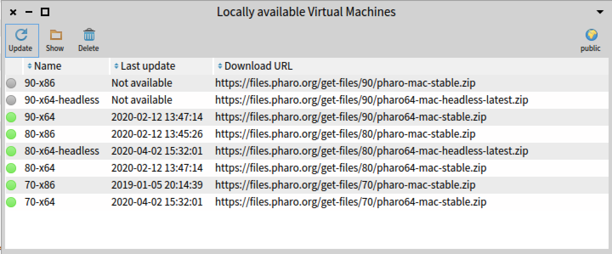

The Virtual Machine manager is available from the main toolbar.
It shows the list of default Virtual Machines (e.g. most used VMs) as well as the Virtual Machines already available locally for Pharo Launcher.

You can download a non-available virtual machine by clicking on the **update** button. If you click on the **update** button when the selected virtual machine(s) is already availble, it will force a new download to get an update virtual machine if available.

A click on the private button will toggle the view between:

* the list of VMs used by Pharo Launcher to launch Pharo images,
* the list of VMs used by Pharo Launcher to determine the Pharo version of images (indeed, we must run the image to get its Pharo version number if not found in metadata aside the image).

vms-presenter-private.png
