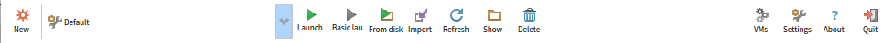
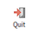
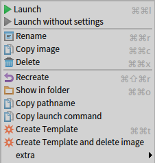

# Global Commands
 Open a window to list and manage Pharo Virtual Machines that can be used by Pharo Launcher. More information in the [Manage vms section](/manage-vms).

 Open Pharo Launcher Settings window. More information on the various settings in the [Settings section](/settings).

 Open a dialog with information about the current Pharo Launcher version.

 Exit Pharo Launcher.

# Image Commands
 Create a new Pharo image.

 Launch the selected Pharo image with the selected launch configuration.

 Launch the selected Pharo image with the selected launch configuration **without global settings** (e.g. settings loaded for all you Pharo image or by Pharo image version).

 Launch an image from anywhere on the file system.

 Import an image from the file system. A pop-up will ask you if you want to import the whole image parent folder or just the image file and associated files (changes, sources, etc.).

 Refresh the list of images by scanning again the image repository.

 Open a system file browser on the selected image file.

 Delete the currently selected image.

  Additional commands available through the contextual menu: 

 * Rename an image
 * Copy the full path name of the selected image to the clipboard
 * Copy the launch command used to by Pharo Launcher to launch the selected launch configuration (and image) to the clipboard.
 * Create a template from the currently selected image. Template will become available in the **Templates** category.
 * Create a template from the currently selected image and delete the image. Template will become available in the **Templates** category.

# Template Commands
  Template commands are available through the contextual menu: 

 * you can rename a template
 * or delete a template from the local cache.

# Virtual Machine Commands
 Will update the selected virtual machines by fetching them again from their known location.

 Open a system file browser on the selected Pharo Virtual Machine.

 Delete the currently selected Pharo Virtual Machine.

 Toggle button used to select either Virtual Machines used to run Pharo image, or Virtual Machines used to determine Pharo version of an image (based on the image format number).
