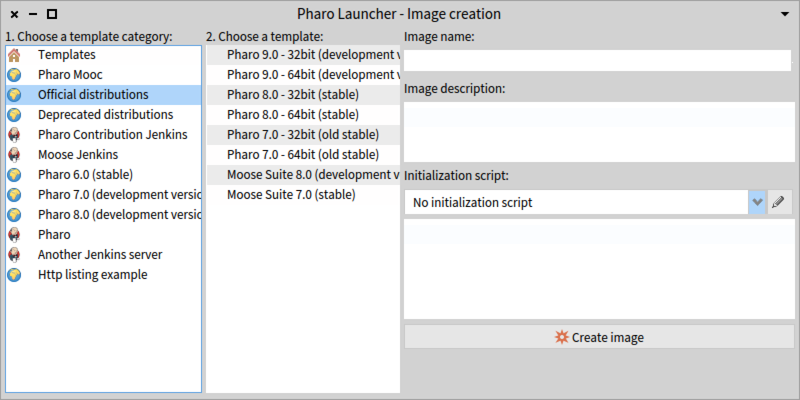
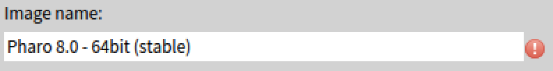
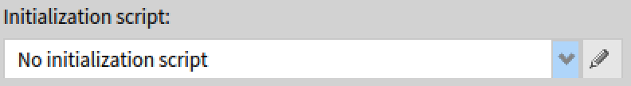

## Create your first image
Click on the new button  (left-most button in the toolbar). 

It will open the image creation window.



In Pharo Launcher, images are created using a template. A template is just a zip file with the pharo image and its associated files (sources, changes).
Pharo Launcher comes with an official list of templates containing core Pharo images but also other commonly used templates (Pharo MOOC, Moose, etc).

1. First select the template category  
Templates are sorted by category to improve searchability. The most popular category is **Official distributions**. It is the default selection.
For more information, see the documentation on templates.
2. Select a template. By default, choose the **current 64-bit stable** Pharo image.
3. Provide image information.  
You now need to provide a name to your image. If the name is not valid, a red mark will appear just after the name text input.
{: style="width:300px"}  
You can optionally provide a description and an [initialization script](#image-initialization-script) to your image.
4. Click on the **Create image** button.

**Important note**: the launcher currently does not fit with the "Save as" image style - since each launcher image
has to be in a new directory. So either use the "Copy" image, then "Launch" and then only "Save" in the target image or copy the "Saved as" image in a new folder and refresh the Launcher view on the right side.

## Where are stored my images?
Launcher files are considered as user documents and so, they are stored in the user document folder, i.e.:

- *$HOME/Documents/Pharo* on OS X,
- *$HOME/My Documents/Pharo* on windows,
- *$HOME/Pharo* on Linux (some Linux distributions provide a document folder but some others not, so we put it in the HOME directory in all cases).

In this folder, you will find your images and virtual machines needed to run images. The default location can be customized in Pharo Launcher settings.

## Image initialization script
When working with Pharo, you often need to load your project code and its dependencies. You could also want to execute some actions once to configure your image. This the purpose of the image initialization script: it is a Smalltalk script that will be **executed at the first launch of the image and will then be disabled**.
When creating an image, you can select an already existing script or create a new one. For your conveniance, there is a script editor included in Pharo Launcher. Just click on the edit button {: style="width:30px"} at the right of the initialization script dropbox. {: style="width:250px"}


Once the initialization script selected, you can have a preview of it just below the drop list:


### Initialization script examples
#### Load a local project
```smalltalk
gitFolder := FileLocator home / 'pharo-launcher'.
Metacello new
	repository: 'gitlocal://', gitFolder fullName, '/src';
	baseline: 'PharoLauncher';
	load
```
#### Load a project hosted on github
```smalltalk
Metacello new
	baseline: 'PharoLauncher';
	repository: 'github://pharo-project/pharo-launcher:master/src';
	load
```

If you need to execute again the initialization script at image launch, select the image in the list of images and then click on the checkbox **Initialization script**. The script will be executed at next image launch and then disabled.
{: style="border:1px solid black;"}