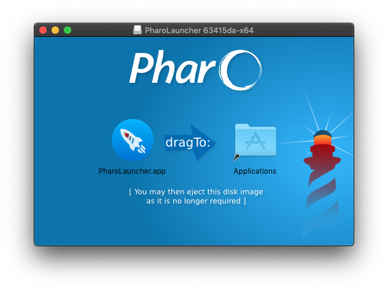

## Downloading Pharo Launcher
You can get Pharo Launcher from the [Pharo website](https://pharo.org/download).
The default download is a 64-bit version.

<p>
	<a class="btn download" href="https://files.pharo.org/pharo-launcher/windows"><i class="fa fa-windows"></i> Windows</a>
	<a class="btn download" href="https://files.pharo.org/pharo-launcher/mac"><i class="fa fa-apple"></i> MacOS</a>
	<a class="btn download" href="https://files.pharo.org/pharo-launcher/linux64"><i class="fa fa-linux"></i> GNU/Linux</a>
	<a class="btn " href="https://files.pharo.org/pharo-launcher/linux32"><i class="fa fa-linux"></i> GNU/Linux (32bit)</a>
</p>

## Install on Mac OS X
Double-click on the dmg file and drop Pharo Launcher app in Applications folder. 


Before being able to run Pharo Launcher, you may need to update temporarily your **security settings**: if you have Mac OS X 10.8 or higher then you might get the following message:


This is due to the OS X Gatekeeper feature that is designed to discourage users from downloading apps from random locations and possibly installing something bad. Assuming you've downloaded Pharo Launcher from Pharo web site, then you have nothing to worry about, and you just need to bypass this warning:

* Recommended - Right click (or command+click) the application icon and select "open"
* Advanced - Enable all application downloads
	* In OS X go to the Apple Menu -> System Preferences -> Security & Privacy -> General
    * Unlock the padlock at the bottom of the window, which will require a computer admin password
    * Where it says "Allow applications downloaded from:" select "Anywhere"
    * OS X will give you a scary warning that is a bit exaggerated. If you're not comfortable with this, use the "right click" method mentioned above.

In all cases OS X will still ask you if you want to open an "unsigned" application the first time it is opened, so new applications that are downloaded can't just start by themselves. Just click on "Open".


**Warning**: There is a high probability that the very first run of Pharo Launcher does nothing. In this case, just run it a second time and Pharo Launcher will open.

## Install on Windows
Run the installer and follow instructions. Be sure to install Pharo Launcher in a place where you have **write privileges**.


The installer wil create a shorcut on the Desktop as well as an application entry in the Windows menu.


**Warning**: Antinvirus can prevent Pharo Launcher to behave correctly
It has been reported on Windows that the Antivirus prevents Pharo Launcher to download the VMs needed to run images. A workaround is to whitelist PharoLauncher or to temporary disable the antivirus when you need to download new VMs.

### Install on Windows Linux Subsystem (WSL)
Thanks to Christopher Fuhrman, the original author of [these instructions](https://fuhrmanator.github.io/2019/02/27/Pharo-in-WSL.html).
#### Preparation
- Install and activate WSL following [Microsoft’s instructions](https://docs.microsoft.com/en-us/windows/wsl/install-win10).
- Install an X Server for Windows. You can use [VcXsrv](https://sourceforge.net/projects/vcxsrv/):
    - Run XLaunch from the start menu, which invokes a wizard.
    - Accept all the defaults on the wizard.
    - At the last page of the wizard, click *Save configuration* specifying `%appdata%\Microsoft\Windows\Start Menu\Programs\Startup` to have VcXsrv start automatically when you start Windows.
- You should `export DISPLAY=localhost:0` (e.g., in your WSL *~/.bashrc*).
- Install Mesa with the command `sudo apt install mesa-utils`.  
This is apparently needed because there are missing libraries for the X11 display used by Pharo. For reference, if you don’t do this step, you’ll get the following message that’s somewhat misleading:
```
$ ./pharo-ui
could not find display driver vm-display-X11; either:
- check that /home/myusername/pharo-dir/pharo-vm/lib/pharo/5.0-201901051900//vm-display-X11.so exists, or
- use the '-plugins <path>' option to tell me where it is, or
- remove DISPLAY from your environment.
```

#### Installation
Note: these instructions are almost the same as for a standard installation on GNU/Linux
- Download the latest version of the Linux 64 version of Pharo Launcher to your home directory:    
```bash
cd
curl -o pharo-launcher.zip -L https://files.pharo.org/pharo-launcher/linux64
```
- Unzip it (you may need to install the unzip tool with sudo apt install unzip):
```bash
unzip pharo-launcher.zip
```
Normally this will create a ~/pharolauncher directory.

- Run Pharo Launcher with the following command:
```bash
pharolauncher/pharo-launcher &
```

## Install on GNU/Linux
- Download the latest version of the Linux 64 version of Pharo Launcher to your home directory:    
```bash
cd
curl -o pharo-launcher.zip -L https://files.pharo.org/pharo-launcher/linux64
```
- Unzip the archive in a place where you have **write privileges** (you may need to install the unzip tool with sudo apt install unzip):
```bash
unzip pharo-launcher.zip
```
Normally this will create a ~/pharolauncher directory.
You can also do it through the UI


- Run Pharo Launcher
```bash
./pharolauncher/pharo-launcher
```
